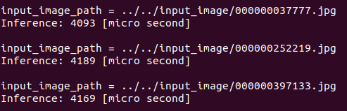
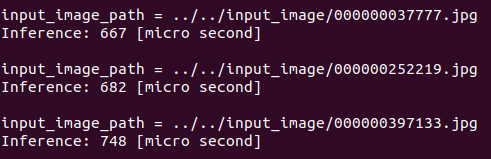
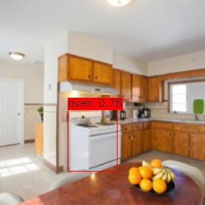
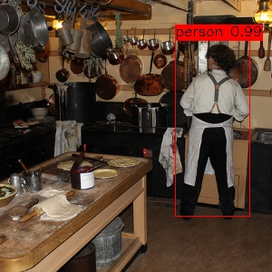
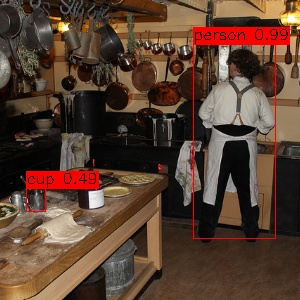

# SSD300 with PyTorch c++ & TRTorch

A c++ implementation of [NVIDIA Corp.'s SSD300](https://github.com/NVIDIA/DeepLearningExamples/tree/master/PyTorch/Detection/SSD) with [PyTorch c++ API](https://pytorch.org/cppdocs/) (LibTorch) and [TRTorch](https://github.com/nvidia/TRTorch/), which optimizes a PyTorch model (TorchScript) by TensorRT directly.
The optimized PyTorch model becomes faster and can be used in the code with no difference than before optimization.

In the case of NVIDIA Corp.'s SSD300, the TRTorch optimization makes it **more than 5 times** faster.

| Before optimization (TorchScript) Average: 4150 [us] | After optimization: (TRTorch) Average: 699 [us] |
| :---: | :---: |
|  |  |

It seems that the results might be different in some cases.

| Before optimization (TorchScript) | After optimization: (TRTorch) |
| :---: | :---: |
|  |  |
|  |  |
|  |  |

The code corresponding to the TRTorch optimization can be found in `SSD300_PyTorch_cpp_TRTorch/src/object_detector/include/object_detector.h`:

```
std::cout << "Optimizing TorchScript model with TRTorch \n\n";
auto in_tensor = torch::randn({1, 3, input_image_size_, input_image_size_});
auto in_tensor_sizes = std::vector<trtorch::ExtraInfo::InputRange>({in_tensor.sizes()});

trtorch::ExtraInfo compile_spec_info(in_tensor_sizes);
compile_spec_info.op_precision = torch::kHalf;

// Optimizes TorchScript model with TRTorch in FP16
// https://nvidia.github.io/TRTorch/v0.0.3/tutorials/getting_started.html#compiling-with-trtorch-in-c
try {
  std::cout << "[ObjectDetector()] trtorch::CompileGraph(); ... \n";
  model_ = trtorch::CompileGraph(model_, compile_spec_info);
  std::cout << "[ObjectDetector()] trtorch::CompileGraph() is done \n\n";
}
catch (...) {
  std::cerr << "[ObjectDetector()] Exception: Could not trtorch::CompileGraph() \n";
  std::exit(EXIT_FAILURE);
}
```


# Pre-requirements

Docker 19.03 or later with NVIDIA Container Toolkit is recommended to run this code without having troubles related to dependencies' version.

* Docker 19.03+
* NVIDIA driver
* NVIDIA Container Toolkit


# How to build

In the host machine, pull a docker image from [my DockerHub repository](https://hub.docker.com/repository/docker/hotsuyuki/ubuntu18_04-cuda10_2-cudnn7_6_5-tensorrt7_0_0-opencv4_4_0) and launch a docker container.

```
$ git clone https://github.com/hotsuyuki/SSD300_PyTorch_cpp_TRTorch.git
$ cd SSD300_PyTorch_cpp_TRTorch/
$ docker container run --gpus all --rm -it -v $PWD:/workspace/SSD300_PyTorch_cpp_TRTorch hotsuyuki/ubuntu18_04-cuda10_2-cudnn7_6_5-tensorrt7_0_0-opencv4_4_0
```

Then in the docker container, download LibTorch v1.5.1 and unzip it by running `before_build.sh`.

```
# cd /workspace/SSD300_PyTorch_cpp_TRTorch/
# sh ./before_build.sh
```

It is needed to set an environment variable with the path to LibTorch v1.5.1 in order to use TRTorch v0.0.3.

```
# export LD_LIBRARY_PATH=$LD_LIBRARY_PATH:/workspace/SSD300_PyTorch_cpp_TRTorch/src/libtorch_v1-5-1/lib/
```

Finally, build the source code.

```
# cd /workspace/SSD300_PyTorch_cpp_TRTorch/src/
# mkdir build
# cd build/
# cmake ..
# cmake --build .
```

This command would produce an executable file `main` in the `build` directory. 


# How to run

The executable file `main` requires at least two arguments:

* `input-dir` (directory path to the input images)
* `model-file` (file path to the model weights)

## (a) Load TorchScript model and optimize it before inference:

The program optimizes the model with TRTorch before inference if a TorchScript file is set as the `model-file` argument and `--optimize` option is added.

```
# ./main --input-dir ../../input_image/ --model-file ../../model/ssd300_torchscript_B1-C3-H300-W300_torch1-5-1_cuda10-2_gpu.pt --optimize
```
or
```
# ./main ../../input_image/ ../../model/ssd300_torchscript_B1-C3-H300-W300_torch1-5-1_cuda10-2_gpu.pt --optimize
```

## (b) Load TRTorch model and skip optimization process:

The optimization process would take a few seconds, but the program can also load the *already-optimized* TRTorch model and the optimization process will be skipped in this case. 

```
# ./main --input-dir ../../input_image/ --model-file ../../model/ssd300_trtorch-fp16_B1-C3-H300-W300_torch1-5-1_cuda10-2_gpu.pt
```
or
```
# ./main ../../input_image/ ../../model/ssd300_trtorch-fp16_B1-C3-H300-W300_torch1-5-1_cuda10-2_gpu.pt
```

This repository provides two TorchScript model files:

* ssd300_torchscript_B1-C3-H300-W300_torch1-5-1_cuda10-2_gpu.pt (exported from [this official jupyter notebook](https://github.com/NVIDIA/TRTorch/blob/master/notebooks/ssd-object-detection-demo.ipynb))
* ssd300_trtorch-fp16_B1-C3-H300-W300_torch1-5-1_cuda10-2_gpu.pt (saved by following [this official tutorial](https://nvidia.github.io/TRTorch/v0.0.3/tutorials/getting_started.html#compiling-with-trtorch-in-c))

The full arguments and options are shown below:

```
usage:
  main [OPTION...] input-dir model-file

positional arguments:
  input-dir   String: Path to input images directory
  model-file  String: Path to TorchScript model file

options:
      --optimize        Bool: Optimize with TRTorch or not
      --conf-thres arg  Float: Object confidence threshold (default: 0.40)
      --iou-thres arg   Float: IoU threshold for NMS (default: 0.45)
  -h, --help            Print usage
```


# Trouble shooting

### Problem:

```
./main: error while loading shared libraries: libtorch_global_deps.so: cannot open shared object file: No such file or directory
```

### Solution:

Set `$LD_LIBRARY_PATH`.

```
# export LD_LIBRARY_PATH=$LD_LIBRARY_PATH:/workspace/SSD300_PyTorch_cpp_TRTorch/src/libtorch_v1-5-1/lib/
```


# References

* [NVIDIA/TRTorch/notebooks/ssd-object-detection-demo.ipynb](https://github.com/NVIDIA/TRTorch/blob/v0.1.0/notebooks/ssd-object-detection-demo.ipynb)
* [NVIDIA/DeepLearningExamples/PyTorch/Detection/SSD](https://github.com/NVIDIA/DeepLearningExamples/tree/master/PyTorch/Detection/SSD)
* [TadaoYamaoka/cxxopts/include/cxxopts.hpp](https://github.com/TadaoYamaoka/cxxopts/blob/master/include/cxxopts.hpp)